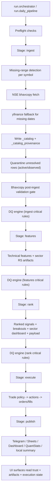

> ARCHIVED - superseded by the canonical docs in /docs. Do not use this file as the current source of truth.

# High-Level Operational Data Flow

This document is the practical, operator-focused map of how the system works in production mode today.
Use it as the primary orientation guide for daily runs, trust checks, execution flow, and recovery.

## 1) System At A Glance

The repo runs a staged pipeline:

`ingest -> features -> rank -> execute -> publish`

Core design intent:
- keep market data (`ohlcv.duckdb`) separate from governance/control plane (`control_plane.duckdb`)
- gate downstream work with trust + DQ checks
- persist every stage artifact under `data/pipeline_runs/<run_id>/...`
- allow isolated retries (especially `publish`) without recomputing upstream stages

## 2) Storage And Ownership

Operational domain (`data-domain operational`) is the default live system.

Primary stores:
- `data/ohlcv.duckdb`: OHLCV, delivery, feature registry/snapshots, trust/quarantine tables
- `data/control_plane.duckdb`: pipeline runs, stage attempts, artifacts, DQ results, alerts, publish logs, model registry
- `data/execution.duckdb`: paper/live execution orders + fills
- `data/raw/NSE_EQ/`: bhavcopy cache files used by ingest/validation
- `data/pipeline_runs/<run_id>/<stage>/attempt_<n>/`: stage artifacts

Trust-specific tables in `ohlcv.duckdb`:
- `_catalog`: operational OHLCV
- `_catalog_provenance`: write-level lineage (`provider`, `validation_status`, `ingest_run_id`, `repair_batch_id`, ...)
- `_catalog_quarantine`: unresolved symbol/date trust issues (`active`, `observed`, `resolved`)

## 3) End-To-End Runtime Flow

## 3.1) Visual Data Flow Diagram

Source asset: `docs/diagrams/operational_data_flow.svg`

## 3.2) Data Trust Quarantine Decision Flow

Source asset: `docs/diagrams/data_trust_decision_flow.svg`

## 4) Ingest Flow (Operational Source Of Record)

Current operational OHLC source contract:
- primary: `NSE bhavcopy`
- fallback: `yfinance` only when bhavcopy for required date is unavailable
- Dhan path is available, but not the default operational source-of-record mode

How ingest computes what to fetch:
1. Resolve `target_end_date = today - 1` (market EOD contract).
2. For each symbol, read last ingested date from `_catalog`.
3. Build required missing date range per symbol.
4. Fetch business dates (excluding weekends + `masterdata.db` holidays).
5. Fetch bhavcopy by date and normalize.
6. Fetch yfinance only for missing bhavcopy dates.
7. Tag every row with trust lineage fields.
8. Upsert into `_catalog`, write `_catalog_provenance`.
9. Mark unresolved rows in `_catalog_quarantine`:
   - `active`: recent and eligible gaps (blocks trust-sensitive stages)
   - `observed`: historical/low-impact unresolved gaps (visible but non-blocking)
10. Resolve quarantine rows automatically when newly ingested rows arrive for those symbol/date keys.

Additional ingest protections:
- unknown out-of-contract future rows cleanup (`_cleanup_off_contract_unknown_rows`)
- quarantine housekeeping downgrade for non-trading dates / repair diagnostics
- provider coverage + unresolved-date DQ checks
- optional post-ingest bhavcopy close-price validation gate in stage wrapper

## 5) Data Trust Model

Trust is computed from `_catalog` + `_catalog_quarantine`.

Status values:
- `trusted`: no active quarantine in trust window, no unknown rows on latest trade date, fallback ratio within threshold
- `degraded`: active quarantine exists (not latest date), unknown rows exist, or fallback ratio too high
- `blocked`: latest trade date itself is actively quarantined
- `legacy`: trust columns absent in catalog schema
- `missing`: DB/table unavailable

Primary metrics:
- `latest_trade_date`
- `latest_validated_date`
- `fallback_ratio_latest`
- `unknown_ratio_latest`
- `active_quarantined_dates`
- `active_quarantined_symbols`
- `latest_provider_stats` (primary/fallback/unknown row counts)

Where trust is enforced:
- ingest metadata + DQ
- features DQ rule `features_trust_quarantine_clear`
- rank stage blocks when trust is `blocked` (unless explicitly overridden)
- execute stage blocks on trust `blocked`, and can optionally block on `degraded`
- publish includes trust banner/notes in Telegram/dashboard summary
- research UI displays trust snapshot and per-symbol trust fields

## 6) DQ Gating (What Can Stop The Pipeline)

DQ engine runs on `ingest`, `features`, and `rank`.

Critical examples:
- ingest duplicate OHLC key
- null required fields
- OHLC consistency failure
- recent universe-wide jump anomaly
- provider coverage too weak / unknown ratio breach
- unresolved dates still active
- features snapshot missing or zero computed rows
- active quarantine still present in features trust window
- rank artifact empty

Rule outcomes are persisted in control plane (`dq_result`), and only `critical` failures hard-stop downstream stages.

## 7) Features, Rank, Execute, Publish

### Features
- computes technical indicators (`rsi`, `adx`, `sma`, `ema`, `macd`, `atr`, `bb`, `roc`, `supertrend`)
- operational mode uses incremental tail recompute by default
- writes feature snapshot artifact + metadata
- computes sector RS / stock-vs-sector context used downstream

### Rank
- runs technical ranking and auxiliary outputs:
  - `ranked_signals.csv`
  - `breakout_scan.csv`
  - `stock_scan.csv`
  - `sector_dashboard.csv`
  - `dashboard_payload.json`
  - `rank_summary.json`
- optional ML shadow overlay integration (`ml_mode=shadow_ml`)

### Execute
- converts ranked universe into actions via strategy policy:
  - `technical`
  - `ml`
  - `hybrid_confirm`
  - `hybrid_overlay`
- performs preview or execution path
- uses risk sizing through `RiskManager` when quantity not supplied
- writes:
  - `trade_actions.csv`
  - `executed_orders.csv`
  - `executed_fills.csv`
  - `positions.csv`
  - `execute_summary.json`
- persists orders/fills in `data/execution.duckdb`

### Publish
- reads rank artifacts and routes to channels via retry-safe delivery manager
- channels can include:
  - Google Sheets targets
  - Telegram summary
  - dashboard payload
  - QuantStats tear sheet
  - local summary mode (`--local-publish`)
- publish delivery is idempotent per dedupe key (`run_id + channel + artifact hash`)

## 8) Research Flow (Separate From Live Ops)

Research is intentionally separated by `data-domain research`.

High-level recipe flow:
1. Build dataset (`AlphaDatasetBuilder`) from research OHLC/features.
2. Train/register model (`train_and_register_model`).
3. Evaluate validation + walk-forward + promotion thresholds.
4. Optional auto-approve / auto-deploy bundle winner to shadow environment.
5. Write reports to `reports/research/...`.

Primary command:
- `python -m research.run_recipe --bundle daily_research --auto-approve --auto-deploy`

## 9) Day-To-Day Commands

Full operational run:
- `PYTHONPATH=. ./.venv/bin/python -m run.orchestrator --data-domain operational`

Safe canary run:
- `PYTHONPATH=. ./.venv/bin/python -m run.orchestrator --canary --symbol-limit 25 --local-publish`

Retry publish only (same run artifacts):
- `PYTHONPATH=. ./.venv/bin/python -m run.orchestrator --run-id <run_id> --stages publish`

Ingest only (NSE primary path):
- `PYTHONPATH=. ./.venv/bin/python -m collectors.daily_update_runner --symbols-only --nse-primary`

Features only:
- `PYTHONPATH=. ./.venv/bin/python -m collectors.daily_update_runner --features-only`

Run dashboards:
- Research (Streamlit): `PYTHONPATH=. ./.venv/bin/streamlit run ui/research/app.py`
- Execution control (NiceGUI): `PYTHONPATH=. ./.venv/bin/python -m ui.execution.app`

## 10) Practical Operator Checklist

Before run:
- confirm credentials in `.env`
- ensure `data/ohlcv.duckdb` and `data/control_plane.duckdb` are writable
- verify no long-running conflicting writer process is holding DuckDB lock

After run:
- pipeline status is `completed` or `completed_with_publish_errors`
- ingest summary has expected `providers_used`, low/zero unresolved active dates
- trust snapshot is not `blocked` (prefer `trusted`)
- features/rank artifacts exist under `data/pipeline_runs/<run_id>/...`
- publish delivery logs show delivered/duplicate with expected channels

If trust is degraded/blocked:
1. inspect `active_quarantined_dates` and unresolved symbols
2. run focused repair/reingest window
3. re-run `ingest -> features -> rank` and confirm trust snapshot improves
4. only allow execution/publish-to-trading when trust returns to acceptable state

## 11) Known Boundaries

- synthetic smoke mode is disabled by design; runs must use real provider data
- operational ingest is trust-first; unresolved recent gaps are quarantined rather than silently accepted
- Dhan auth renewal has a known follow-up in `docs/pending_todo.md` (`RenewToken`/`DH-905` behavior)
- publish can be retried independently, but external channel availability still governs final delivery state
