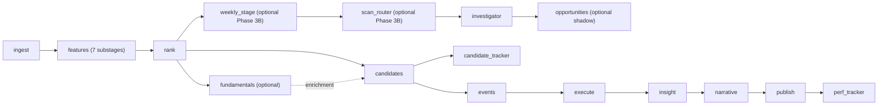

# Operational Data Flow

- **Purpose:** Detailed execution, handoff, DQ, and retry flow for the current operational pipeline.
- **Audience:** Operators debugging a run, engineers changing a stage, and reviewers tracing artifacts.
- **Last verified:** 2026-07-14
- **Source of truth:** `src/ai_trading_system/pipeline/orchestrator.py`, `src/ai_trading_system/pipeline/preflight.py`, `src/ai_trading_system/pipeline/contracts.py`, and `src/ai_trading_system/pipeline/stages/`.

---

Start with the [System Guide](../SYSTEM_GUIDE.md). This document expands only the pipeline execution contract.

## Entrypoints and stage selection

| Entrypoint | Behavior |
|---|---|
| `ai-trading-pipeline` / `python -m ai_trading_system.pipeline.orchestrator` | Canonical orchestrator. The CLI default names logical stages and expands `features` into seven substages. |
| `ai-trading-daily` / `python -m ai_trading_system.pipeline.daily_pipeline` | Daily-operations wrapper around the same orchestrator; verify its current defaults before changing operator automation. |

The canonical logical order is:

```text
ingest -> features -> rank -> weekly_stage -> scan_router -> investigator -> opportunities -> fundamentals -> candidates
       -> candidate_tracker -> events -> execute -> insight -> narrative
       -> publish -> perf_tracker
```

The persisted `PIPELINE_ORDER` expands `features`:

```text
ingest
-> features_technical
-> features_sector_rs
-> features_valuation
-> features_stock_valuation_bands
-> features_sector_earnings
-> features_phase1
-> features_snapshot
-> rank -> weekly_stage -> scan_router -> investigator -> opportunities -> fundamentals -> candidates -> candidate_tracker
-> events -> execute -> insight -> narrative -> publish -> perf_tracker
```

`weekly_stage`, `scan_router`, `fundamentals`, and `opportunities` are optional. The CLI enables fundamentals by default. Phase 3B compare/shadow mode inserts weekly coverage and routing; registry shadow mode inserts opportunities. `candidate_tracker` remains enabled by default. Explicit `--stages` values are authoritative.

## End-to-end handoff



| Stage | Required handoff | Important outputs | Failure boundary |
|---|---|---|---|
| `ingest` | Provider data and master-data mapping | Trusted OHLCV, provenance/quarantine, ingest artifacts | Trust/DQ can block all downstream work. |
| `features_*` | Trusted catalog plus earlier feature substages | Technical, sector, valuation, earnings, derived features, final snapshot | Each substage is a separately persisted attempt; final snapshot DQ gates rank. |
| `rank` | Feature snapshot | Ranked signals, Stage 1, breakouts, patterns, stock/sector dashboards | Empty or invalid canonical rank output can block downstream work. |
| `weekly_stage` | As-of OHLCV and latest sector mapping | Universal stock/sector history and light discovery | No rank cap; append-only control-plane history. |
| `scan_router` | Rank, stage, lifecycle, and fill-derived positions | Routing, coverage, monitor, and comparison artifacts | No broker calls; active-position coverage is invariant. |
| `investigator` | Registered rank artifacts | Investigation queue, lifecycle/gate artifacts, decision history | Non-executable; optional evidence degrades rather than authorizes execution. |
| `opportunities` | Registered rank and optional Investigator artifacts | Canonical registry history and shadow audit artifacts | Required-source failure is recorded but does not block execution or publish. |
| `fundamentals` | Configured fundamentals sources | Scores, watchlists, enrichment artifacts | Optional in the orchestrator contract. |
| `candidates` | `ranked_signals`; optional rank/fundamental evidence | `final_candidates.csv` and summary | Required rank artifact is a hard gate. |
| `candidate_tracker` | `final_candidates` | Durable tracker state, alerts, reviews, snapshots | Tracker persistence is independent of execution ledger state. |
| `events` | Candidate/rank context | Event packet and enriched evidence | Missing optional enrichment must remain distinguishable from trusted evidence. |
| `execute` | Candidate/event inputs plus trust and policy context | Actions, orders, fills, positions | Paper is safe default; critical DQ and risk gates block dispatch. |
| `insight` | Upstream decision and execution artifacts | Structured analyst brief | Consumes artifacts; does not recompute upstream stages. |
| `narrative` | Insight artifact and LLM configuration | Market report | Can be omitted from an explicit stage list. |
| `publish` | Registered materialized artifacts | External/local deliveries and summary | Retryable for the same `run_id`; must not recompute upstream data. |
| `perf_tracker` | Published/ranked cohort context | Research-domain cohort updates | Operational and research persistence remain separated. |

Per-stage files, field contracts, and recovery details are under [stages](../INDEX.md#stages-14).

## Preflight, trust, and DQ

The CLI currently skips preflight by default; `--run-preflight` enables local readiness checks. A non-passing preflight result aborts before stage execution and is retained in run metadata. Network publish checks can be controlled separately by the current CLI flags.

DQ evaluation persists rule outcomes. `red_block` failures abort; repairable failures follow the configured DQ mode and may be downgraded in relaxed mode with their original band retained. Details and repair paths are in [data trust and DQ](data_trust_and_dq.md) and [DQ failure response](../runbooks/dq_failure_response.md).

## Run, stage, attempt, and artifact lifecycle

- A `pipeline_run` identifies one logical run and its final state.
- A `pipeline_stage_run` identifies one stage attempt. Feature substages appear independently.
- A retry creates a new `attempt_<n>` directory and stage-attempt record.
- A `pipeline_artifact` records the output URI, producer, content hash, and available schema metadata.
- Downstream resolution uses registered artifacts, including selected latest-artifact fallback behavior in the orchestrator; directory scanning is diagnostic only.

Same-date runs can auto-resume. `--new-run` creates a fresh run ID, while `--force-rerun` creates new attempts for requested completed stages. Reusing `--run-id` is the normal way to retry publish or another isolated stage.

## Failure and recovery boundaries

- Fix `red_block` trust/DQ failures upstream before retrying downstream stages.
- Retry a deterministic stage against the same registered inputs when its failure was local or transient.
- Retry `publish` for the existing run after a channel outage; do not rerun rank merely to republish.
- Back up live databases before schema repair, backfill, or migration.
- Never use synthetic data to make a canary pass.

See [daily operations](../runbooks/daily_operations.md), [troubleshooting](../runbooks/troubleshooting.md), and [publish retry](../runbooks/publish_retry.md).
