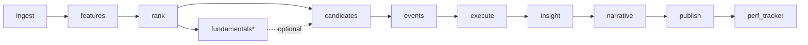

# Operational Data Flow

- **Purpose:** End-to-end run flow across the 11-stage operational pipeline, with stage purpose, key artifact, preflight, and failure boundaries.
- **Audience:** Operators debugging a run, engineers wiring new stages, reviewers tracking artifact lineage.
- **Last verified:** 2026-05-16
- **Source of truth:** `src/ai_trading_system/pipeline/orchestrator.py` (`PIPELINE_ORDER` line 41, preflight wiring lines 123/307-324), `src/ai_trading_system/pipeline/preflight.py`, `src/ai_trading_system/pipeline/stages/*.py`, `src/ai_trading_system/pipeline/migrations/001_pipeline_governance.sql` through `005_ml_datasets.sql`, `src/ai_trading_system/pipeline/daily_pipeline.py`.

## Entrypoints

| Command | Module | What it runs |
|---|---|---|
| `ai-trading-pipeline` | `pipeline.orchestrator:main` | Full 11-stage `PIPELINE_ORDER` (`orchestrator.py:41`); `fundamentals` skipped unless enabled. |
| `ai-trading-daily` | `pipeline.daily_pipeline:main` | Defaults to 10 stages: `ingest,features,rank,candidates,events,execute,insight,narrative,publish,perf_tracker` (`daily_pipeline.py:472`). In `--canary` mode this collapses to `ingest,features,rank` (`daily_pipeline.py:88-90`). |

> **Note.** Earlier docs called `ai-trading-daily` a "5-stage legacy wrapper" (`ingest→features→rank→execute→publish`). The current code default is 10 stages and only collapses to 3 in canary mode. Verify before publishing any 5-stage claim.

## Stage sequence (Mermaid)

## Preflight

Before stage execution, `PipelineOrchestrator.run()` invokes `PreflightChecker.run()` (`orchestrator.py:307-324`) unless `--skip-preflight` is passed (`orchestrator.py:805-813`). Preflight returns `status: passed | failed | …`; any non-`passed` status raises a `PreflightFailed` error, fires a `preflight_failed` alert, and aborts the run before any stage starts. `--skip-publish-network-checks` independently disables Telegram/Google DNS probes (`orchestrator.py:844`). Preflight results are persisted into `run_metadata["preflight"]`.

## Per-stage flow

Each row: stage → purpose → key artifact written (also see [`../stages/<stage>.md`](../stages/)).

| # | Stage | Purpose | Key artifact / write target | Stage doc |
|---|---|---|---|---|
| 1 | `ingest` | Pull NSE bhavcopy (source-of-record), Dhan (fallback + delivery), yfinance (last resort); validate, quarantine, compute trust summary | `data/ohlcv.duckdb::ohlcv` + `ohlc.csv` under attempt dir | [ingest](../stages/ingest.md) |
| 2 | `features` | Compute indicators (RSI, MACD, Supertrend, ATR, EMA, VWAP, etc.), sector RS, universe index, pattern features | Per-symbol Parquet under `data/feature_store/<symbol_id>/` | [features](../stages/features.md) |
| 3 | `rank` | Composite scoring, breakout detection, stage classifier, sector dashboard, optional LightGBM overlay | `ranked_signals.csv`, `breakout_signals.csv`, `pattern_signals.csv`, `stock_scan_output.csv`, `sector_dashboard.csv` | [rank](../stages/rank.md) |
| 4 | `fundamentals` * | (Optional) Screener.in import + scoring; enrich rank | `fundamental_scores.csv`, `fundamental_summary.csv` | [fundamentals](../stages/fundamentals.md) |
| 5 | `candidates` | Deterministic filter from rank outputs into executable candidate set with entry/exit logic | `candidates.json` | [candidates](../stages/candidates.md) |
| 6 | `events` | Trigger collector + event packet builder + LLM router + noise filter + enrichment | `event_packet.json`, `event_enriched_rank.csv` | [events](../stages/events.md) |
| 7 | `execute` | Risk gates → adapter dispatch (paper or Dhan live); writes order/fill ledger | `trade_actions.csv`, `executed_orders.csv`, `fills.csv`; `execution_order` + `execution_fill` tables in `data/execution.duckdb` (default in `domains/execution/store.py:29`) | [execute](../stages/execute.md) |
| 8 | `insight` | Build analyst brief from rank + execution context | `market_insight.json` | [insight](../stages/insight.md) |
| 9 | `narrative` | LLM-rendered market narrative from insight (config: `config/llm_brain.yaml`, override via `LLM_BRAIN_CONFIG`) | `market_report.json` | [narrative](../stages/narrative.md) |
| 10 | `publish` | Multi-channel delivery: Telegram, Google Sheets, QuantStats, PDF, daily-gainers, watchlist digest | External delivery + `publish_summary.json` | [publish](../stages/publish.md) |
| 11 | `perf_tracker` | Forward-return cohort tracker across the research domain | `rank_cohort_performance` rows in research DuckDB | [perf_tracker](../stages/perf_tracker.md) |

`*` `fundamentals` is in `OPTIONAL_STAGES` (`orchestrator.py:44`) and skipped unless explicitly enabled.

## Failure / retry boundaries — the run/stage/attempt model

Per `pipeline/migrations/001_pipeline_governance.sql` (and follow-ups 002–005):

- **`pipeline_run`** — one row per orchestrator invocation; tracks lifecycle and final status.
- **`pipeline_stage_run`** — one row per *(run, stage, attempt)*. A failed stage can be re-attempted; each attempt gets its own row and its own artifact directory `data/pipeline_runs/<run_id>/<stage>/attempt_<n>/`.
- **`pipeline_artifact`** — registry of every artifact written, keyed by URI and `content_hash`. Used for downstream lookup and integrity checks.
- **`dq_result`** — per-rule outcomes for the stage's DQ evaluation (see [data_trust_and_dq.md](./data_trust_and_dq.md)).

Failure semantics from `pipeline/dq/engine.py`:
- A `red_block` DQ failure raises `DataQualityCriticalError` and aborts the run; no retry will succeed without an upstream fix.
- A `red_repairable` DQ failure raises `DataQualityRepairableError`; in `dq_mode=relaxed` (default) these are downgraded to `amber` and the stage proceeds.
- A `publish` channel may raise `PublishStageError`. Channel-level blocking vs non-blocking semantics live in `domains/publish/delivery_manager.py` — re-verify before documenting individual channel roles (the audit truth map's taxonomy of `publish_of_record / publish_auxiliary / publish_optional / informational / diagnostic` could not be confirmed by a grep of `delivery_manager.py` at the time of writing).

## ai-trading-pipeline vs ai-trading-daily — when to use which

- `ai-trading-pipeline` is the canonical full run; use it whenever you need the complete 11-stage flow including `fundamentals` (when enabled) and `insight/narrative`.
- `ai-trading-daily` is a thinner wrapper around the same orchestrator with daily-operations defaults (logging, run-id resolution for the trading date, canary mode); it still calls the same stage wrappers. Its default stage list omits `fundamentals` and `--canary` reduces the run to `ingest,features,rank`.

## Related reading

- [overview.md](./overview.md) — high-level system mental model.
- [storage_and_lineage.md](./storage_and_lineage.md) — where artifacts land and how lineage is tracked.
- [data_trust_and_dq.md](./data_trust_and_dq.md) — DQ semantics and recovery.
