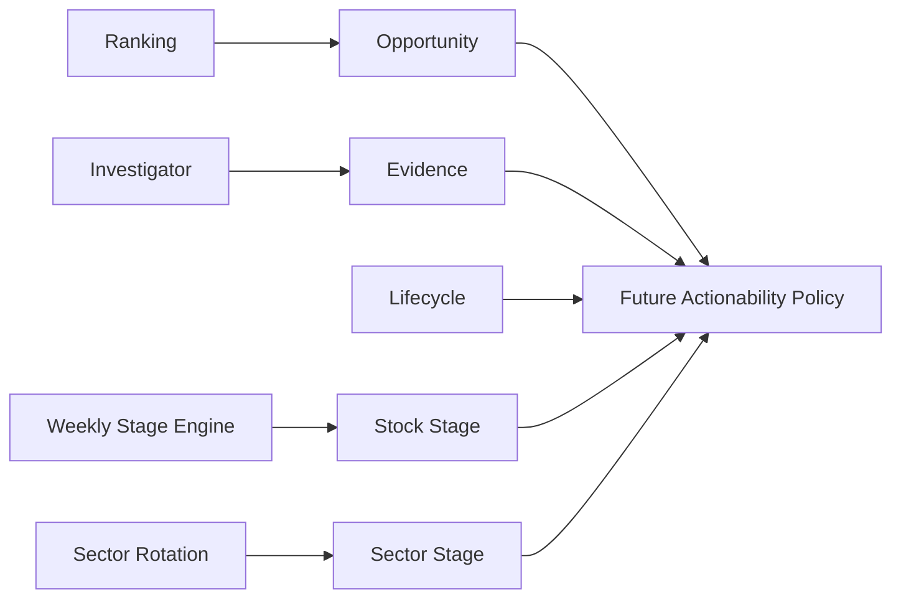

# Opportunity Lifecycle Contracts

- **Purpose:** Define the canonical Phase-1 vocabulary for opportunity, evidence, lifecycle, structural stage, retention, policy guards, and attribution.
- **Audience:** Ranking, Investigator, candidate-tracker, execution-policy, research, and operator-surface developers.
- **Last verified:** 2026-07-14
- **Source of truth:** `src/ai_trading_system/domains/opportunities/`.

---

## Four independent axes

The opportunity domain preserves four independent observations. It does not compute a blended score.

1. **Opportunity** is cross-sectional attractiveness from Ranking.
2. **Evidence** is pattern, accumulation, volume, delivery, breakout, sector, and market evidence from Investigator and scanners.
3. **Lifecycle** is the state of one candidate/setup episode.
4. **Structural stage** is the Weinstein-style weekly stage of the stock or sector.



Lifecycle is not a ranking factor. Weinstein stage is not an Investigator score. Pattern state is not lifecycle state. Candidate action is not an execution order.

## Identity and episode boundaries

`SymbolIdentity` is the listed security identified by `exchange` and `symbol_id`. `CandidateEpisodeIdentity` adds `candidate_id`, `setup_id`, and an aware `episode_started_at` timestamp. A symbol can therefore have multiple independent episodes without reusing its symbol as an episode ID.

Phase 1 defines these values but does not generate IDs or persist episodes. The existing candidate-tracker store remains unchanged.

## Ranking and evidence snapshots

`OpportunitySnapshot` wraps current rank output without copying ranking algorithms or factors. It carries the opportunity score, position, percentile, velocity, factor-score mapping, rank model version, and ranking timestamp.

`EvidenceSnapshot` carries Investigator evidence without inferring lifecycle. It records the evidence score, canonical Investigator verdict, component quality scores, extension and failure risk, positive/negative/missing evidence, model version, and evaluation timestamp. Existing `PatternSignal` records remain the detailed pattern source; the opportunity contract does not replace their artifact schema.

## Stock stage and sector stage

`WeinsteinStage` includes all four stages, all four transition directions, and `unknown`. A `StageSnapshot` preserves:

- provisional, locked, and monitoring-effective stage;
- provisional/locked/unknown status;
- confidence score, band, components, and formula version;
- observation and lock timestamps;
- source-week boundaries;
- previous locked stage, age, transition reason, and classifier version.

`SectorStageSnapshot` contains its own `StageSnapshot` plus sector identity, relative-strength state, and rotation state. Stock and sector stages are never substituted for one another.

### Provisional and locked semantics

The monitoring-effective stage is the provisional stage when one exists, otherwise the locked stage. Policy selection is explicit:

- Monitoring can display the provisional observation.
- Normal entry uses only the locked stage.
- Early entry can inspect a provisional `transition_1_to_2` while retaining the locked baseline.

A later weekly lock does not rewrite a `DecisionContextSnapshot`. A same-week provisional transition that does not lock is attributed as `provisional_stage_nonconfirmation`, not automatically as a classification error.

### Stage confidence

`stage-confidence-v1` is a pure calculation over typed `0–100` components:

```text
25% MA slope quality
+ 20% price-position quality
+ 20% weekly relative-strength quality
+ 15% base/breakout quality
+ 10% weekly volume confirmation
+ 10% transition persistence
- failed-breakout penalty
```

The result is clamped to `0–100`. Bands are `low` for `0–49`, `medium` for `50–64`, `high` for `65–79`, and `very_high` for `80–100`.

The current weekly classifier emits `0–1` confidence. Only `adapt_legacy_weekly_stage` converts that scale to `0–100`; existing weekly-stage CSV values remain unchanged.

## Lifecycle, follow-through, and progress

`CandidateState` models an episode from `unseen` through discovery, investigation, setup, trigger, confirmation, advancement, weakening, failure, exit, and archive. `pending_3d` is not a candidate state; it is a `FollowthroughStatus`.

`ProgressSnapshot` separately records whether rank velocity, evidence, contraction, volume dry-up, MA slope, pivot distance, relative strength, or sector alignment improved. Its status is `improving`, `stable`, `stalled`, `deteriorating`, or `unknown`. Candidate-tracker health statuses adapt to progress, never to lifecycle.

## Entry eligibility and retention

Entry eligibility and candidate retention are separate policies. A Stage-1 accumulation episode can remain retained while being ineligible for a new long entry.

The Phase-1 retention configuration supplies both `max_days_in_state` and `max_days_without_progress`. Confirmed and advancing states have no fixed state expiry but use a ten-day no-progress review. Pending follow-through is governed by its explicit follow-through window. Extended episodes are reviewed daily. Failed/exited episodes default to immediate archive eligibility. Phase 1 does not run a retention scheduler.

### Structural guards

The early-entry helper is contract-level only. It requires a high-confidence provisional stock transition, locked sector Stage 2, improving sector relative strength, `ready` lifecycle, evidence of at least 80, low extension risk, an allowed market regime, and no supplied portfolio blocker. Passing returns `conditionally_eligible` with a default maximum pilot multiplier of `0.35`.

The normal-entry helper requires locked stock Stage 2 with confidence of at least 65, a locked sector transition/Stage 2, and a sector regime that is not `risk_off`. Stage 3/4 structures and two provisional structures block new-long structural eligibility. These helpers do not call execution services or alter current risk policies.

## Attribution taxonomy

Attribution is rule-versioned and does not inspect P&L:

- `provisional_stage_nonconfirmation`: a provisional decision-stage observation fails to lock on the same weekly bar.
- `stage_classification_error`: a locked Stage-2 decision is contradicted within weeks 2–4 by negative 30-week MA slope, close below the MA, negative weekly RS slope, and opposite structure for two completed weekly closes.
- `stage_transition_after_valid_entry`: the locked stage holds through the minimum valid period and deteriorates later.
- `exogenous_regime_shock`: supplied market/sector evidence confirms a shock exemption.
- `valid_signal_normal_failure`: a complete evaluation satisfies no error or shock rule.
- `undetermined`: forward evidence is incomplete.

An `OutcomeAttributionRecord` cannot record a stage-classification error without explicit supporting evidence.

## Compatibility mappings

Compatibility helpers return the canonical value plus warnings. Unknown or ambiguous input is never silently guessed.

| Existing representation | Canonical interpretation |
|---|---|
| `S1`, `STAGE_1*` | `stage_1_basing` |
| `S1_TO_S2`, `stage1_to_stage2` | `transition_1_to_2` |
| `S2`, `stage2`, `strong_stage2`, `stage2_uptrend` | `stage_2_advancing` |
| `S3`, `S4`, `UNDEFINED` | Stage 3, Stage 4, or `unknown` |
| `PENDING_3D`, `CONFIRMED`, `FAILED_3D` | Follow-through pending, confirmed, or failed |
| Investigator conviction values | `EvidenceVerdict` |
| Stage-1 `ACCUMULATING`, `BREAKOUT_READY`, `INVALIDATED` | Early accumulation, ready, or failed lifecycle |
| Candidate-tracker health values | `ProgressStatus` |

`PROMOTION_PENDING` requires its pattern-promotion value: `PENDING_3D` maps to pending follow-through and `BREAKOUT_ATTEMPT` maps to triggered. Monitoring/conviction statuses that do not establish lifecycle return no canonical lifecycle value and include a warning.

## Serialization example

All top-level snapshots use `opportunity-contract-v1`. Enums serialize to stable lowercase values; dates and aware datetimes use ISO-8601; nested tuples serialize as arrays; mappings are key-sorted.

```json
{
  "candidate_id": "candidate-2026-001",
  "setup_id": "setup-2026-001",
  "symbol_id": "EXAMPLE",
  "exchange": "NSE",
  "lifecycle_state": "ready",
  "followthrough_status": "not_applicable",
  "contract_version": "opportunity-contract-v1"
}
```

## Phase 1 non-goals

Phase 1 does not add or migrate registry tables, generate IDs, add pipeline stages, transition production candidates, admit/archive candidates automatically, alter ranking, place orders, change sizing, add APIs or UI pages, backfill history, or calculate Weinstein components from OHLCV. The current rank, candidate-tracker, execution, and publish behavior is unchanged.
