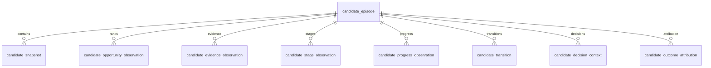

# Opportunity Registry

- **Purpose:** Define the canonical candidate-episode history and reconstruction contract.
- **Audience:** Engineers persisting or reading opportunity lifecycle history.
- **Last verified:** 2026-07-14
- **Source of truth:** `src/ai_trading_system/domains/opportunities/registry/` and `src/ai_trading_system/pipeline/migrations/032_opportunity_registry.sql`.

---

Start with the [System Guide](../SYSTEM_GUIDE.md). The persistence-free vocabulary is documented in [opportunity lifecycle contracts](opportunity_lifecycle_contracts.md); storage roots and shared lineage are documented in [storage and lineage](storage_and_lineage.md).

## Purpose and ownership

The opportunity registry is an append-oriented governance history in `$DATA_ROOT/control_plane.duckdb`. It records only data written through `OpportunityRegistryService`. The optional Phase 3A shadow stage and Phase 3B shadow extensions write through that service; no execution stage depends on the registry.

The existing `$DATA_ROOT/candidate_tracker.duckdb` remains the operational mutable tracker for the current `candidate_tracker` stage. Phase 2 does not migrate, synchronize, or replace that store. For new canonical registry callers, the control-plane tables are authoritative; for the current pipeline, the tracker database remains authoritative.

## Symbol and episode identity

A symbol is a market identity. A candidate is a time-bounded setup episode. `setup_id` is a SHA-256 identity over normalized exchange, symbol, setup family, caller-supplied admission identity, and episode start. `candidate_id` is derived from that setup ID. Replaying the same admission returns the same episode, while a new setup cycle receives a new identity and the next per-symbol episode number.

Setup families are part of matching. An early-accumulation setup and a post-breakout re-entry are not merged merely because they share a symbol.

## Data model



`candidate_episode` is the only mutable summary. Closing may set its terminal status, timestamp, reason, and lineage. All observation, transition, decision, and attribution rows are immutable. The registry schema version is persisted as `opportunity-registry-schema-v1`.

The four domain axes remain separate:

- Opportunity observations preserve ranking values and model version.
- Evidence observations preserve Investigator and supporting evidence.
- Lifecycle state is preserved in unified snapshots and explicit transitions.
- Stock and sector structural stages are separate scoped observations.

The full Phase 1 contract is retained as canonical JSON wherever a canonical object exists. Query columns are materialized in addition to, not instead of, that JSON.

## Idempotency and transactions

Record IDs and idempotency keys use SHA-256 over normalized candidate, record type, observation time, run, stage attempt, artifact hash, and contract version. A second SHA-256 value covers the semantic payload.

- The same key and semantic hash returns `DUPLICATE`.
- The same key with a different semantic hash raises `OpportunityRegistryConflictError`.
- Existing history is never overwritten.
- Batch conflicts roll back every new row; exact duplicates may coexist with successful new rows.

Multi-record operations use one explicit DuckDB transaction inside the shared `RegistryStore` writer lock. Episode-plus-initial-snapshot, snapshot-plus-stage, and snapshot-plus-transition operations commit or roll back together.

## Lineage and timestamps

Observations retain run ID, stage name, attempt number, artifact type/path/hash, and applicable model, classifier, policy, or rule version. Values are parameterized in SQL. Artifact files need not remain present for a historical row to be interpreted, and the registry does not require physical foreign keys to mutable artifact locations.

Control-plane timestamps are UTC-naive at rest, consistent with existing tables. The typed registry API accepts and returns timezone-aware datetimes and performs UTC conversion at the persistence boundary.

## Stage history without repainting

A Tuesday provisional `transition_1_to_2` observation and a Friday locked `stage_1_basing` observation are different rows. Friday does not update Tuesday. A Tuesday decision retains its serialized decision-time stage, while current state selects Friday and a Tuesday as-of query selects only Tuesday data.

## Reconstruction

`candidate_current_state` derives one row per episode from the latest record in each observation family. Every family uses deterministic ordering by effective time, observed time, creation time, and stable ID. Missing rank, evidence, stock-stage, sector-stage, progress, or decision data remains null rather than being borrowed from another episode.

`get_candidate_state_as_of(candidate_id, cutoff)` applies the cutoff independently to every family. It also presents a currently closed episode as open when the requested time precedes its close, preventing future leakage. `get_candidate_timeline` merges episode open/close markers with all record families and orders ties deterministically.

## Close and re-entry

Closing is explicit. An identical repeated close is idempotent; a different repeated close conflicts. Closed episodes reject new snapshots, stages, evidence, opportunity, progress, transitions, and decisions. Outcome attribution may be added after closure because it evaluates the completed episode. Re-entry opens a new episode with a new admission identity. Reopening an old episode is not supported.

## Rollback and non-goals

Rollback means disabling future registry consumers while retaining the tables and history. There is no destructive down migration.

The registry itself does not infer admissions or transitions. Phase 3A supplies optional shadow adapters and policies; Phase 3B supplies stage/routing lineage and conservative position-state recovery. Backfill, API/UI surfaces, ranking changes, execution eligibility, sizing, order generation, and broker access remain outside the registry contract.

## Example timeline

```text
Monday    episode opened; rank observation appended
Tuesday   provisional stock stage appended; decision context captures it
Wednesday Investigator evidence appended
Friday    locked stock stage appended; current state advances without rewriting Tuesday
Later     episode closed; a new setup cycle opens a separate episode
```
