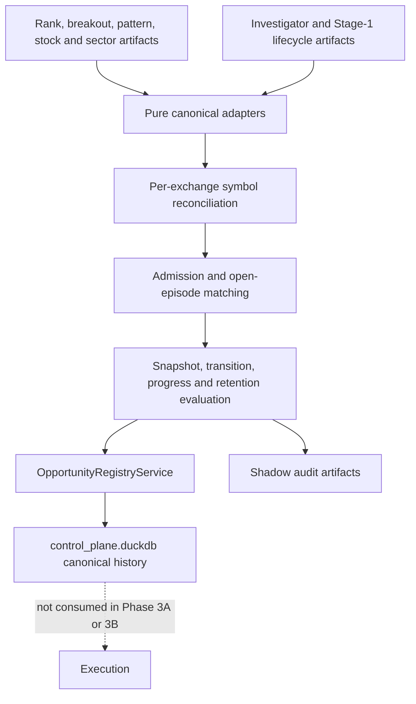

# Opportunity Shadow Orchestration

- **Purpose:** Define the non-authoritative Phase 3A adapter, admission, lifecycle, retention, and registry-write workflow.
- **Audience:** Engineers operating or changing canonical opportunity reconciliation.
- **Last verified:** 2026-07-14
- **Source of truth:** `src/ai_trading_system/domains/opportunities/adapters/`, `src/ai_trading_system/domains/opportunities/orchestration/`, and `src/ai_trading_system/pipeline/stages/opportunities.py`.

---

Start with the [System Guide](../SYSTEM_GUIDE.md). Phase 1 — Canonical Opportunity Contracts owns the [domain contracts](opportunity_lifecycle_contracts.md), Phase 2 — Persistent Candidate Registry owns the [registry](opportunity_registry.md), and this document defines Phase 3A — Shadow Lifecycle Orchestration. Phase 3B — Universe Coverage and Scan Routing extends it without replacing it; Phase 4 — Read-Only Operator Surfaces remains deferred.

## Purpose and boundary

The `opportunities` stage runs immediately after `investigator` only when `--opportunity-registry-mode shadow` is selected. It reads registered rank and Investigator artifacts, converts available fields into canonical contracts, evaluates candidates, writes canonical history through `OpportunityRegistryService`, and emits audit artifacts. It never changes ranking, candidate-tracker, execution, publish, broker, Sheets, Telegram, or UI inputs.

Mode `off` is the default and does not add the stage to the default CLI stage list. Dry run evaluates the complete workflow and writes attempt-local audit artifacts without opportunity-registry records.



## Source adapters and unknown values

Adapters are pure and return records, warnings, rejected rows, and source metadata. Rank position may come from stable artifact order; percentile may come from position and row count. Rank velocity requires a prior registry rank. Investigator total score remains required, while unavailable components remain null. Missing Investigator output is not negative evidence.

Weekly stock confidence is converted from `0–1` to `0–100`. A source week is locked only when explicitly locked or already completed, and a source creation/lock timestamp must exist. Same-day weeks remain provisional. Current sector artifacts supply RS and rotation but not Weinstein structure, so their structural stage is `UNKNOWN`; positive sector rank never implies Stage 2.

Legacy Stage-1 lifecycle, follow-through, and tracker-health values use the Phase 1 warning-bearing compatibility mappings. Tracker health affects progress only.

## Admission and setup matching

`admission-rules-v1` defaults are rank percentile 90, rank improvement of five positions with percentile 75, Investigator score 70, accumulation 75, ready pattern 80, qualified Tier A breakout 80, and S1→S2 confidence 75. Stage 3/4 blocks new long admission.

Every admission records a named reason, `setup-family-v1` family, rule version, evidence, blockers, warnings, and stable admission identity. Exact open-family matching wins. The configured progression is `early_accumulation → base_building → stage_1_to_2_transition → breakout → post_breakout_followthrough`, with a 30-day continuity limit. Episode setup identity remains immutable. Ambiguous or incompatible open episodes produce a conflict; closed episodes are never reopened.

## Lifecycle, progress, and retention

`lifecycle-policy-v1` is pure and persists at most one transition per candidate per shadow run. Monitoring states may collapse to the strongest fully satisfied pre-trigger state. Trigger and terminal semantics are not skipped. A direct `TRIGGERED → CONFIRMED` is allowed only when the first later observation already contains explicit confirmed follow-through; transition metadata records the collapsed pending observation.

Normal trigger requires locked stock Stage 2. A provisional S1→S2 trigger requires confidence 75, locked sector Stage 2, evidence 80, low extension risk, and an allowed market regime. Stage 3 weakens active candidates; Stage 4 fails and closes position-free candidates. Phase 3A alone does not recover position-only episodes; Phase 3B shadow mode may recover them from fill-derived active-position state.

Progress uses only comparable values. Two positives mean improving, two negatives or a hard structural event mean deteriorating, comparable non-material movement is stable, and absent comparisons remain unknown. Retention applies the Phase 1 age and stagnation limits independently. Rank decline alone cannot close a confirmed candidate.

## Idempotency, DQ, and failure behavior

Lineage combines normalized source hashes and registered paths. An exact same-run replay is reported as a registry duplicate and writes no new history. Semantic-key conflicts remain explicit audit rows. Missing optional sources, unavailable sector stage, provisional-only stage, ambiguous lifecycle values, and incomplete evidence are warnings.

A missing required `ranked_signals` artifact fails only the `opportunities` stage. The orchestrator continues later stages and finishes `completed_with_opportunity_errors`. Row-level warnings or conflicts mark opportunity task metadata degraded without changing the main pipeline result.

## Artifacts and multi-day example

Each attempt writes the summary plus admission, update, transition, closure, reconciliation, warning, rejection, conflict, and current-state CSVs under `$DATA_ROOT/pipeline_runs/<run_id>/opportunities/attempt_<n>/`. DuckDB remains authoritative.

```text
Day 1   strong Stage-1 accumulation opens episode 1
Day 10  improving structure reuses episode 1 and reaches setup-forming/ready
Day 15  qualified guarded breakout records triggered
Day 18  confirmed follow-through records confirmed
Later   Stage 2→3 records weakening; supplied exit closes episode 1
Months  a new admission identity opens episode 2
```

## Non-goals

Phase 3A does not generate orders, eligibility, sizing, portfolio allocation, broker calls, API/UI surfaces, notifications, historical backfills, model updates, or synchronization with `candidate_tracker.duckdb`.
