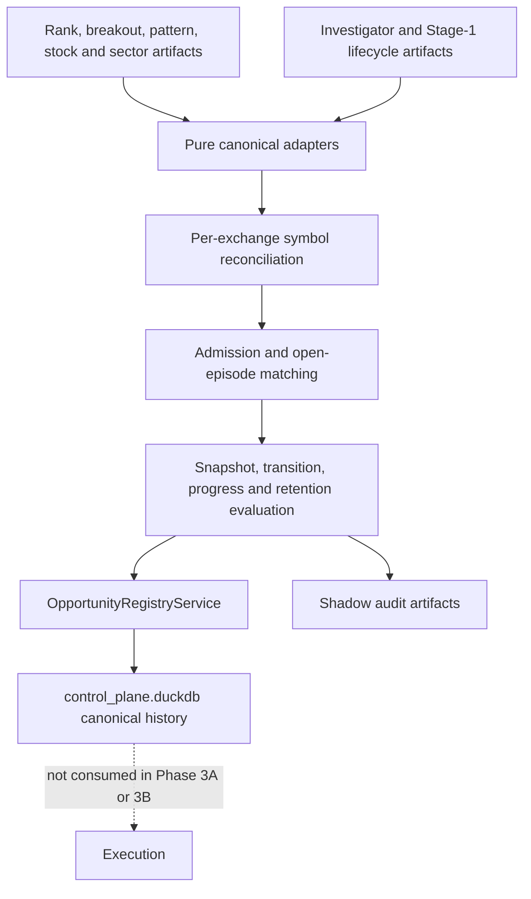

# Opportunity Shadow Orchestration

- **Purpose:** Define the non-authoritative Phase 3A adapter, admission, lifecycle, retention, and registry-write workflow.
- **Audience:** Engineers operating or changing canonical opportunity reconciliation.
- **Last verified:** 2026-07-16
- **Source of truth:** `src/ai_trading_system/domains/opportunities/adapters/`, `src/ai_trading_system/domains/opportunities/orchestration/`, and `src/ai_trading_system/pipeline/stages/opportunities.py`.

---

Start with the [System Guide](../SYSTEM_GUIDE.md). Phase 1 — Canonical Opportunity Contracts owns the [domain contracts](opportunity_lifecycle_contracts.md), Phase 2 — Persistent Candidate Registry owns the [registry](opportunity_registry.md), and this document defines Phase 3A — Shadow Lifecycle Orchestration. Phase 3B — Universe Coverage and Scan Routing extends it without replacing it; Phase 4 — Read-Only Operator Surfaces remains deferred.

Phase 3C-1 adds membership and correction governance around Phase 3B universal
stage history. Corrections append `stage_correction_impact` review markers for
potentially affected open episodes and immutable decision history. They do not
rewrite this orchestration's snapshots or transitions and do not change
execution behavior.

## Purpose and boundary

The `opportunities` stage runs immediately after `investigator` only when `--opportunity-registry-mode shadow` is selected. It reads registered rank and Investigator artifacts, converts available fields into canonical contracts, evaluates candidates, writes canonical history through `OpportunityRegistryService`, and emits audit artifacts. It never changes ranking, candidate-tracker, execution, publish, broker, Sheets, Telegram, or UI inputs.

Mode `off` is the default and does not add the stage to the default CLI stage list. Dry run evaluates the complete workflow and writes attempt-local audit artifacts without opportunity-registry records.



## Source adapters and unknown values

Adapters are pure and return records, warnings, rejected rows, and source metadata. Rank position may come from stable artifact order; percentile may come from position and row count. Rank velocity requires a prior registry rank. Investigator total score remains required, while unavailable components remain null. Missing Investigator output is not negative evidence.

Weekly stock confidence is converted from `0–1` to `0–100`. A source week is locked only when explicitly locked or already completed, and a source creation/lock timestamp must exist. Same-day weeks remain provisional. Current sector artifacts supply RS and rotation but not Weinstein structure, so their structural stage is `UNKNOWN`; positive sector rank never implies Stage 2.

Legacy Stage-1 lifecycle, follow-through, and tracker-health values use the Phase 1 warning-bearing compatibility mappings. Tracker health affects progress only.

## Admission and setup matching

`admission-rules-v1` defaults are rank percentile 90, rank improvement of five positions with percentile 75, Investigator score 70, accumulation 75, ready pattern 80, qualified Tier A breakout 80, and S1→S2 confidence 75. Stage 3/4 blocks new long admission.

Every admission evaluates all seven predicates, records their observed values, thresholds, pass status, and bundle-level source row IDs, then selects one primary reason and `setup-family-v1.1` family using the fingerprinted `admission-rules-v1.1` precedence. The canonical primary values remain `opening_reason` and `setup_family`; structured results are nullable episode columns and artifact fields. Exact open-family matching wins. The configured progression is `early_accumulation → base_building → stage_1_to_2_transition → breakout → post_breakout_followthrough`, with a 30-day continuity limit. Episode setup identity remains immutable. When no exact or progression-compatible episode exists, a qualified breakout supersedes exactly one open `momentum_leader`: one transaction opens the breakout episode, closes the predecessor, writes `MOMENTUM_SUPERSEDED_BY_BREAKOUT`, and appends the successor observations. Multiple momentum episodes or any mixed incompatible open set remains a conflict. Closed episodes are never reopened.

## Lifecycle, progress, and retention

`lifecycle-policy-v1.1` is pure and persists at most one transition per candidate per shadow run. The patch label records ADR-0006 A2's completed-week correction while reserving `lifecycle-policy-v2` for a future calibrated size-haircut policy. Monitoring states may collapse to the strongest fully satisfied pre-trigger state. Trigger and terminal semantics are not skipped. A direct `TRIGGERED → CONFIRMED` is allowed only when the first later observation already contains explicit confirmed follow-through; transition metadata records the collapsed pending observation.

Normal trigger requires locked stock Stage 2 and does not consult the early gate. A provisional stock S1→S2 trigger reads the latest governed completed-week locked sector observation known at the decision timestamp; the current incomplete-week sector aggregation is monitoring evidence only. Prior locked Stage 2 passes. Missing mapping, latest-only membership, insufficient constituent coverage, no locked snapshot, and any non-Stage-2 prior lock fail closed under the ADR taxonomy. Prior locked Stage 1 with a current provisional transition or improving breadth is tagged `stage_1_improving_blocked_v1` for calibration but remains blocked. The gate also requires stock confidence 75, evidence 80, low extension risk, and an allowed market regime.

The opportunities summary carries per-taxonomy and per-cohort counts. Candidate update and transition artifacts carry the prior locked stage/week/confidence, current provisional stage/velocity, membership and coverage status, taxonomy, and cohort. Migration 038 adds nullable direct stamps for the three ADR monitoring fields plus taxonomy and cohort when a `candidate_decision_context` is written; the shadow orchestrator does not synthesize decision contexts merely to populate them.

Stage 3 weakens active candidates; Stage 4 fails and closes position-free candidates. Phase 3A alone does not recover position-only episodes. In Phase 3C-3 shadow mode, a live position attaches only when an open episode has compatible lifecycle and trigger timing; same symbol alone is insufficient, multiple episodes are ambiguous, and closed episodes are not reopened. Missing or incompatible matches create deterministic recovery proposals. Recovery defaults to `report_only`; reviewed or explicitly enabled automatic recovery uses an `INVESTIGATING` initial marker and never creates fabricated pre-entry rank, evidence, transition, follow-through, or stage history.

Progress uses only comparable values. Two positives mean improving, two negatives or a hard structural event mean deteriorating, comparable non-material movement is stable, and absent comparisons remain unknown. Retention applies the Phase 1 age and stagnation limits independently. Under `opportunity-retention-v1.1`, the compatibility fields `days_in_state` and `days_without_progress` count canonical observed OHLCV sessions, not runs or calendar days. The first persisted observation advances a session; later same-session observations cannot alter the counters, although an improvement updates `last_progress_at` and resets stagnation when the next session is counted. Lifecycle transitions reset both counters. Rank decline alone cannot close a confirmed candidate.

## Idempotency, DQ, and failure behavior

Lineage combines normalized source hashes and registered paths. An exact same-run replay is reported as a registry duplicate and writes no new history. Semantic-key conflicts remain explicit audit rows. Missing optional sources, unavailable sector stage, provisional-only stage, ambiguous lifecycle values, and incomplete evidence are warnings.

Same-run replay equivalence is defined within one policy snapshot. Replaying a
pre-A2 gate-affected decision under `lifecycle-policy-v1.1` can legitimately
produce the same idempotency key with different decision blockers and therefore
fails closed as an `OpportunityRegistryConflictError`. Gate-untouched records
remain replay-compatible because migration-038 evidence columns are outside
semantic payload hashes.

Migration-039 counter-lineage columns are likewise outside snapshot semantic
payloads and replay identities. A legacy row with no counted-session stamp
bootstraps from its latest snapshot date, preventing the first post-migration
same-date rerun from adding a session.

A missing required `ranked_signals` artifact fails only the `opportunities` stage. The orchestrator continues later stages and finishes `completed_with_opportunity_errors`. Row-level warnings or conflicts mark opportunity task metadata degraded without changing the main pipeline result.

## Artifacts and multi-day example

Each attempt writes the summary plus admission, update, transition, closure, reconciliation, warning, rejection, conflict, current-state, position-episode compatibility, recovery proposal/action, and position-monitor reconciliation CSVs under `$DATA_ROOT/pipeline_runs/<run_id>/opportunities/attempt_<n>/`. DuckDB remains authoritative.

```text
Day 1   strong Stage-1 accumulation opens episode 1
Day 10  improving structure reuses episode 1 and reaches setup-forming/ready
Day 15  qualified guarded breakout records triggered
Day 18  confirmed follow-through records confirmed
Later   Stage 2→3 records weakening; supplied exit closes episode 1
Months  a new admission identity opens episode 2
```

## Phase 4A read boundary

Phase 4A reads this history through a separate application service and FastAPI
package under `interfaces/api/`. Governed database rows take precedence over
immutable manifests and summary artifacts. Universal stage responses use the
existing effective-time plus recorded-availability resolver, so late
corrections cannot repaint earlier responses. Missing migrations, empty
history, and governance conflicts remain explicit; handlers do not run this
orchestration or construct its write-capable store.

## Non-goals

Phase 3A does not generate orders, eligibility, sizing, portfolio allocation, broker calls, API/UI surfaces, notifications, historical backfills, model updates, or synchronization with `candidate_tracker.duckdb`.

## Phase 3C-4 observational instrumentation

The orchestrator owns one run-scoped `PerformanceCollector`. It wraps stage
execution and passes the same collector through `StageContext`; opportunity
adapters and persistence retain their existing behavior and expose their existing
measured durations to the collector. Metrics use monotonic nanosecond clocks and
UTC wall-clock labels. `functional_status` is never derived from
`performance_status`. Advisory `PASS`, `WARN`, `FAIL`, and `NOT_EVALUATED`
results use `phase3c4-performance-policy-v1`; `performance_fail_pipeline=false`
is the Phase 3C-4 default. Ranking, routing, Investigator, lifecycle, execution,
and publish decisions do not consume these metrics.

## Phase 3C-5 calibration boundary

Phase 3C-5 consumes reconstructed candidate-decision evidence only in an
offline builder. A sample is authoritative only when every input, membership
observation, stage decision, and correction used was available as of the
decision timestamp; the decision has a stable episode identity; historical
universe and listing evidence include later-delisted and failed candidates; and
the forward outcome is complete and attributable. Ambiguous correction impact,
stage conflicts or cycles, unresolved corporate actions, and duplicate sample
identities are quarantined. Immature outcomes remain pending rather than being
coerced to zero.

Position-only recovery records are not entry-calibration history. The resulting
readiness checks and manifests are advisory and do not feed ranking, routing,
Investigator, lifecycle, execution, or publish.
