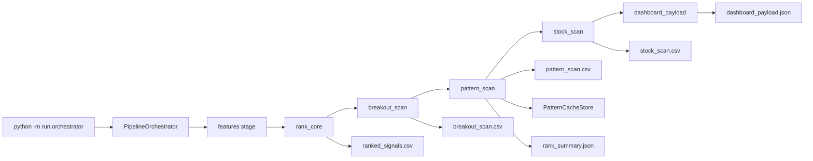
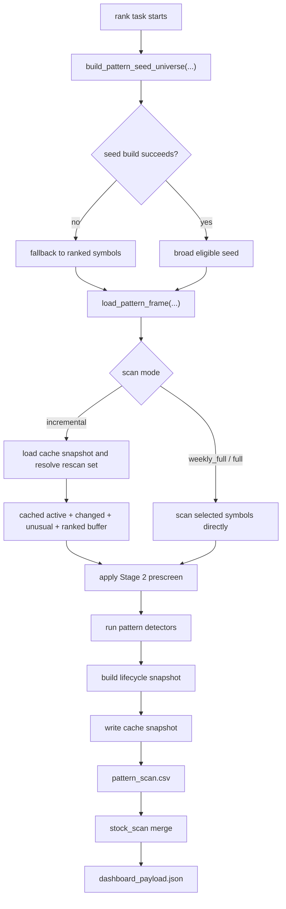

# Pattern Scan

## Overview

Pattern scan is the rank-stage sidecar that searches live OHLCV history for bullish base and breakout setups, preserves lifecycle state across runs, and then feeds the final published symbol view.

It runs inside the `rank` stage after `rank_core` and `breakout_scan`, and before the final `stock_scan` and `dashboard_payload` artifacts are assembled.

Current implemented architecture after Phases 1-6:

- Phase 1 decoupled pattern scan from the ranked shortlist by building a broad seed universe first.
- Phase 2 hardened Stage 2 into a structural gate plus a soft score.
- Phase 3 added `weekly_full`, `incremental`, and `full` scan modes with cache-backed lifecycle state.
- Phase 4 added operational tiering and priority metadata.
- Phase 5 added volume z-score integration without removing `volume_ratio`.
- Phase 6 changed final publication so ranking is the prioritizer, not the gatekeeper.

This document describes current behavior only.

## Entry Point

The operational entry point is:

```bash
cd /Users/prashant/my-ai-project/trading_system/ai-trading-system
./.venv/bin/python -m run.orchestrator --run-date 2026-04-25 --stages features,rank
```

Control flow:

1. `run/orchestrator.py` forwards into `ai_trading_system.pipeline.orchestrator`.
2. `PipelineOrchestrator` parses flags, creates a `run_id`, and executes stages in order.
3. The `rank` stage delegates to `RankOrchestrationService`.
4. `RankOrchestrationService.run(...)` runs these tasks in order:
   - `rank_core`
   - `breakout_scan`
   - `pattern_scan`
   - `stock_scan`
   - `sector_dashboard`
   - `dashboard_payload`
5. `pattern_scan` builds a seed universe, loads a pattern frame, runs detectors, merges lifecycle state from cache, writes `pattern_scan.csv`, and records seed and scan metadata in `rank_summary.json`.
6. `stock_scan` merges ranked leaders, pattern discoveries, and breakout candidates into the final symbol-level view.
7. `dashboard_payload.json` exposes top samples plus categorized views such as `ranked_leaders`, `pattern_discoveries`, and `breakout_candidates`.

## High-Level Architecture



## Control Flow



## Seed Universe Election

Seed-universe selection is owned by `ai_trading_system.domains.ranking.patterns.universe`.

`build_pattern_seed_universe(...)` loads the latest per-symbol OHLCV snapshot and derives seed-selection inputs directly from market data. The snapshot includes:

- `feature_ready`
- `liquidity_score`
- `close`
- `vol_20_avg`
- `volume_ratio_20`
- `volume_zscore_20`
- `return_1d_pct`
- `true_range_today`
- `atr_20`
- `atr_20_pct`
- `sma_150`
- `sma_200`
- `sma200_slope_20d_pct`
- `near_52w_high_pct`

Seed buckets are built in this exact priority order:

1. Cached active pattern symbols from `PatternCacheStore`
2. Stage 2 structural-proxy symbols
3. Unusual movers
4. Remaining liquid, feature-ready symbols

The buckets are deduplicated in that order, then truncated by `pattern_seed_max_symbols`.

### Hard Gates And Defaults

The broad-universe seed is still filtered before scanning.

`apply_pattern_liquidity_gate(...)` requires:

- `feature_ready == True`
- `liquidity_score >= 0.2`
- `close >= 20`

Operational meaning:

- `feature_ready` currently means the symbol has at least 50 bars of history, so derived features are mature enough to use.
- `close >= 20` means the latest closing price must be at least 20 in the market’s native price units.
- `pattern_seed_max_symbols` controls scan breadth.
- `pattern_max_symbols` does not control scan breadth. It only caps how many rows are retained in the final `pattern_scan.csv` artifact.

### Stage 2 Structural-Proxy Bucket

The seed builder has a local structural Stage 2 proxy used only for seed prioritization. A symbol enters this bucket only if all of these are true:

- `close > sma_150`
- `close > sma_200`
- `sma_150 > sma_200`
- `sma200_slope_20d_pct > 0`
- `near_52w_high_pct <= 25`

This proxy is used only to prioritize the seed universe. It is not the persisted Stage 2 contract used elsewhere.

### Unusual Movers

Unusual movers are not a simple OR bucket. A symbol must first pass:

- `liquidity_score >= 0.20`
- `close >= 50`
- `vol_20_avg >= pattern_unusual_mover_min_vol20_avg`

Then it gets an unusual-mover score:

- `+1` for strong 1-day price move
- `+2` for `volume_zscore_20 >= 2.0`, else `+1` for `volume_ratio_20 >= 1.5`
- `+1` for ATR/range expansion

The symbol is an unusual mover if the final unusual-mover score is at least 2.

## Scan Modes

`build_pattern_signals(...)` supports exactly three scan modes:

- `weekly_full`
- `incremental`
- `full`

Current orchestrator CLI default:

- `--pattern-scan-mode incremental`

### `weekly_full`

- Scans the selected broad seed directly
- Does not use carry-forward shortcuts
- Writes a cache snapshot tagged like `weekly_full_<date>`
- Rebuilds lifecycle state from fresh detector output

### `full`

- Runs a one-off full scan across the supplied symbol set
- Behaves like `weekly_full`
- Writes a cache snapshot tagged like `full:<date>:<count>`

### `incremental`

- Uses the latest cache snapshot as the canonical lifecycle baseline
- Falls back to `full` if no valid prior cache snapshot exists
- Builds the rescan set from:
  - active cached symbols
  - symbols needing rescan
  - current unusual movers
  - bounded top-ranked continuity bucket

The incremental continuity bucket is controlled by:

- `--pattern-incremental-ranked-buffer` default `50`

## Pattern Evaluation Flow

Pattern evaluation is owned by `ai_trading_system.domains.ranking.patterns.evaluation`.

The rank service performs this flow:

1. Build or fall back to a seed symbol list
2. Load the pattern frame with `load_pattern_frame(...)`
3. Attach rank context from `ranked_df`
   - `stage2_score`
   - `stage2_label`
   - `rel_strength_score`
4. Resolve scan symbols by scan mode
5. Apply a Stage 2 prescreen
6. Run pattern detectors serially or in parallel
7. Build the lifecycle snapshot
8. Write the cache snapshot
9. Emit `pattern_scan.csv`

### Current Stage 2 Prescreen Nuance

The rank service currently calls `build_pattern_signals(...)` with these defaults:

- `pattern_stage2_only=True`
- `pattern_min_stage2_score=70.0`

These are current service defaults. They are not exposed as first-class CLI flags in the orchestrator today.

Operational consequence:

- even `weekly_full` and `full` runs started from the CLI are still Stage-2-prescreened by default when Stage 2 context is available
- broad seed selection and final publication were decoupled from ranking, but the detector scan is still Stage-2-prescreened unless the service params are overridden programmatically

## Lifecycle Model

Pattern scan uses two different state layers:

- `pattern_state`: detector-owned state
- `pattern_lifecycle_state`: cache-owned operational state

`pattern_state` stays detector-facing and only uses:

- `watchlist`
- `confirmed`

`pattern_lifecycle_state` is owned by `PatternCacheStore` and can be:

- `watchlist`
- `confirmed`
- `invalidated`
- `expired`

Cache responsibilities:

- preserve carry-forward rows across days
- invalidate rows when price breaches the invalidation level
- expire watchlist rows after the watchlist expiry window
- expire confirmed rows after the confirmed expiry window
- retain invalidated rows briefly before expiring them

Current orchestrator defaults:

- `--pattern-watchlist-expiry-bars 10`
- `--pattern-confirmed-expiry-bars 20`
- `--pattern-invalidated-retention-bars 5`

`pattern_scan.csv` excludes rows whose lifecycle state is already `expired`, but the cache can still retain expired rows historically.

## Phase 4, 5, And 6 Outputs

### Phase 4 Pattern Prioritization

Pattern rows can include:

- `pattern_operational_tier`
- `pattern_priority_score`
- `pattern_priority_rank`

These are overlay metadata. They do not replace:

- `pattern_score`
- `pattern_rank`

### Phase 5 Volume Z-Scores

Pattern rows can include:

- `volume_zscore_20`
- `volume_zscore_50`

Breakout and pattern confirmation still honor `volume_ratio`. Z-scores are additive confirmation signals, not a replacement.

### Phase 6 Final Integration

Final publication is built from the union of:

- ranked leaders
- pattern discoveries
- breakout candidates

`stock_scan.csv` can include:

- `pattern_positive`
- `breakout_positive`
- `discovered_by_pattern_scan`

Current definitions:

- `pattern_positive` requires a non-suppression pattern row with lifecycle `watchlist` or `confirmed`
- `breakout_positive` requires a breakout row with `breakout_state` in `qualified` or `watchlist`
- `discovered_by_pattern_scan` is true only for symbols that are not in the ranked universe and are `pattern_positive`

`dashboard_payload.json` exposes:

- `ranked_leaders`
- `pattern_discoveries`
- `breakout_candidates`

## Artifact Map

Rank-stage artifacts are written under:

```text
data/pipeline_runs/<run_id>/rank/attempt_<n>/
```

Pattern-scan-related files:

- `ranked_signals.csv`
- `breakout_scan.csv`
- `pattern_scan.csv`
- `stock_scan.csv`
- `dashboard_payload.json`
- `rank_summary.json`
- `task_status.json`

Important fields to inspect:

- `rank_summary.json.pattern_seed_metadata`
- `rank_summary.json.pattern_seed_metadata.pattern_scan_metrics`
- `task_status.json.pattern_scan`

## Operator Manual

### Daily Incremental Scan

```bash
cd /Users/prashant/my-ai-project/trading_system/ai-trading-system

./.venv/bin/python -m run.orchestrator \
  --run-date 2026-04-25 \
  --stages rank \
  --local-publish \
  --pattern-scan-mode incremental \
  --pattern-workers 1
```

Use `pattern-workers 1` on macOS when you want to avoid multiprocessing noise and keep the run easier to reason about.

### Weekly Full Scan

```bash
cd /Users/prashant/my-ai-project/trading_system/ai-trading-system

./.venv/bin/python -m run.orchestrator \
  --run-date 2026-04-25 \
  --stages rank \
  --local-publish \
  --pattern-scan-mode weekly_full \
  --pattern-seed-max-symbols 5000 \
  --pattern-max-symbols 5000 \
  --pattern-workers 1
```

This is the widest currently supported CLI scan over the broad eligible universe.

### Refresh Features Before Weekly Scan

```bash
cd /Users/prashant/my-ai-project/trading_system/ai-trading-system

./.venv/bin/python -m run.orchestrator \
  --run-date 2026-04-25 \
  --stages features,rank \
  --local-publish \
  --pattern-scan-mode weekly_full \
  --pattern-seed-max-symbols 5000 \
  --pattern-max-symbols 5000 \
  --pattern-workers 1
```

### Inspect The Latest Pattern Scan

```bash
cd /Users/prashant/my-ai-project/trading_system/ai-trading-system

LATEST=$(ls -td data/pipeline_runs/*/rank/attempt_* | head -1)
echo "$LATEST"
ls "$LATEST"
```

```bash
cd /Users/prashant/my-ai-project/trading_system/ai-trading-system

./.venv/bin/python - <<'PY'
import os
import pandas as pd

latest = os.popen("ls -td data/pipeline_runs/*/rank/attempt_* | head -1").read().strip()
df = pd.read_csv(f"{latest}/pattern_scan.csv")
cols = [c for c in [
    "symbol_id",
    "pattern_family",
    "pattern_state",
    "pattern_lifecycle_state",
    "pattern_operational_tier",
    "pattern_priority_score",
    "pattern_priority_rank",
    "volume_ratio_20",
    "volume_zscore_20",
    "volume_zscore_50",
    "stage2_score",
    "stage2_label",
] if c in df.columns]
print(df[cols].head(50).to_string(index=False))
PY
```

### Inspect Seed Metadata

```bash
cd /Users/prashant/my-ai-project/trading_system/ai-trading-system

./.venv/bin/python - <<'PY'
import json
import os

latest = os.popen("ls -td data/pipeline_runs/*/rank/attempt_* | head -1").read().strip()
with open(f"{latest}/rank_summary.json", "r", encoding="utf-8") as handle:
    payload = json.load(handle)
print(json.dumps(payload.get("pattern_seed_metadata", {}), indent=2))
PY
```

Key seed metadata fields:

- `fallback_used`
- `fallback_reason`
- `broad_universe_count`
- `feature_ready_count`
- `liquidity_pass_count`
- `seed_symbol_count`
- `seed_source_counts`
- `pattern_scan_metrics`

### Inspect Dashboard Sections

```bash
cd /Users/prashant/my-ai-project/trading_system/ai-trading-system

./.venv/bin/python - <<'PY'
import json
import os

latest = os.popen("ls -td data/pipeline_runs/*/rank/attempt_* | head -1").read().strip()
with open(f"{latest}/dashboard_payload.json", "r", encoding="utf-8") as handle:
    payload = json.load(handle)

for key in ["ranked_leaders", "pattern_discoveries", "breakout_candidates"]:
    rows = payload.get(key, [])
    print(f"\\n== {key} ({len(rows)}) ==")
    for row in rows[:5]:
        print(row)
PY
```

### Compare Latest Pattern Run To The Previous One

```bash
cd /Users/prashant/my-ai-project/trading_system/ai-trading-system

./.venv/bin/python - <<'PY'
import os
import pandas as pd

runs = os.popen("ls -td data/pipeline_runs/*/rank/attempt_* | head -2").read().strip().splitlines()
if len(runs) < 2:
    raise SystemExit("Need at least two rank attempts to compare.")

latest, previous = runs[0], runs[1]
latest_df = pd.read_csv(f"{latest}/pattern_scan.csv")
previous_df = pd.read_csv(f"{previous}/pattern_scan.csv")

print("latest:", latest, "rows=", len(latest_df))
print("previous:", previous, "rows=", len(previous_df))
print("latest columns only:", sorted(set(latest_df.columns) - set(previous_df.columns)))
print("previous columns only:", sorted(set(previous_df.columns) - set(latest_df.columns)))
PY
```

## Troubleshooting

### Seed Builder Fell Back To Ranked Symbols

Check:

- `rank_summary.json.pattern_seed_metadata.fallback_used`
- `rank_summary.json.pattern_seed_metadata.fallback_reason`

If `fallback_used` is true, the broad seed-universe path failed and the rank service reverted to the ranked symbol list.

### `pattern_scan.csv` Is Empty

Common causes:

- seed build failed and fallback universe was also empty
- Stage 2 prescreen filtered all symbols because `pattern_stage2_only=True` and no symbols met `pattern_min_stage2_score`
- detector inputs had insufficient history
- the task failed and `task_status.json.pattern_scan` contains the root cause

### `pattern_discoveries` Is Empty

This does not always mean pattern scan failed.

If the ranked universe already covers the entire published `stock_scan` symbol set, the dashboard payload reports that there are no non-ranked discoveries to show. In that case the summary can include:

- `ranked_universe_covers_stock_scan = true`
- `discovery_visibility_reason = ranked_universe_covers_stock_scan`

### Stage-2-Only Behavior Is Unexpected

The current rank service still defaults to:

- `pattern_stage2_only=True`
- `pattern_min_stage2_score=70.0`

This means a CLI `weekly_full` run is not literally “scan everything in the DB.” It is “scan the broad eligible seed, then Stage-2-prescreen before detector execution.”

### Interpreting `feature_ready`

`feature_ready` currently means the symbol has at least 50 bars available in the latest universe snapshot. If a symbol is newly listed or its history is incomplete, it may be excluded from the broad seed even in a weekly full run.

### Interpreting `close >= 20`

This is a minimum latest-close filter in the broad seed liquidity gate. Symbols trading below 20 on the latest bar are excluded from the broad eligible universe before detector scan.

## Current Limitations

A CLI “whole universe” run still means “whole eligible universe,” not literally every listed symbol in the database.

Current CLI broad scans still exclude symbols that fail:

- `feature_ready`
- `liquidity_score >= 0.2`
- `close >= 20`

Current CLI broad scans are also still subject to the rank-service Stage 2 prescreen:

- `pattern_stage2_only=True`
- `pattern_min_stage2_score=70.0`

To truly scan every listed symbol, code and config changes would still be required:

- relax or parameterize the hard gates in `ai_trading_system.domains.ranking.patterns.universe`
- expose Stage 2 prescreen controls through orchestrator CLI/config instead of leaving them as service defaults

Until that happens, the recommended operator wording is:

- “broad eligible universe scan” for `weekly_full` and `full`
- not “every listed symbol scan”
