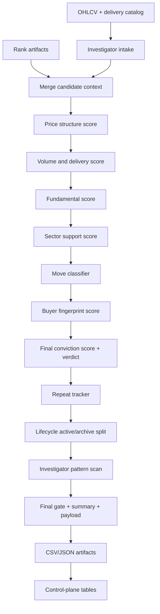

# Stage: investigator

- **Purpose:** Convert post-rank gainer, accumulation, trap, repeat, and pattern evidence into an operator-facing investigation queue.
- **Audience:** Operator, developer, debugging
- **Last verified:** 2026-06-19
- **Source of truth:**
  - `src/ai_trading_system/pipeline/stages/investigator.py`
  - `src/ai_trading_system/domains/investigator/service.py`
  - `src/ai_trading_system/domains/investigator/{intake,price_structure,volume_anatomy,fundamentals,sector_context,move_classifier,buyer_fingerprint,scoring,repeat_tracker,lifecycle,pattern_scan,payload}.py`
  - `src/ai_trading_system/pipeline/migrations/019_investigator.sql`
  - `src/ai_trading_system/pipeline/migrations/020_investigator_multi_trigger.sql`
  - `src/ai_trading_system/ui/execution_api/services/readmodels/investigator.py`

---

## Purpose

`investigator` runs immediately after `rank`. It is a research and operator-decision stage, not an execution stage. Its job is to answer:

- Which latest NSE gainers are credible accumulation candidates?
- Which apparent gainers look like one-candle traps or low-delivery operator spikes?
- Which symbols keep reappearing over a rolling window with improving price, rank, and volume behavior?
- Which active investigator names have early pattern evidence even before a normal Stage 2 prescreen accepts them?
- Which names should be tracked, archived, or moved to final manual review?

The stage deliberately leaves `execution_eligible = False` for scored rows. It can feed operator review and publish surfaces, but it does not authorize orders by itself.

## Pipeline Position

Current orchestrator order places `investigator` directly after `rank`:

```text
ingest -> features -> rank -> investigator -> fundamentals -> candidates -> candidate_tracker -> events -> execute -> insight -> publish -> perf_tracker
```

The stage is post-rank because it enriches gainer intake with ranked signals, stock scan, breakout scan, and sector dashboard context.

## Design Goals

- Surface non-obvious accumulation candidates that may not yet pass the main ranked or Stage 2 gates.
- Separate credible buying from noise traps by combining candle shape, volume, delivery, rank, sector, trigger, and fundamentals evidence.
- Preserve historical recurrence so repeat accumulation is visible over a rolling window.
- Materialize every major decision table as an artifact for publish, API, and audit.
- Keep synthetic smoke artifacts disabled; investigator decisions must be based on real runtime data.

## Non-Goals

- It does not mutate broker state or place orders.
- It does not bypass rank-stage data trust. It consumes post-rank artifacts and the trusted OHLCV catalog.
- It does not write pattern cache entries from investigator pattern scans.
- It does not mark names as execution-ready; manual or downstream gates remain responsible for trade eligibility.

## Entrypoints

- Stage wrapper: `src/ai_trading_system/pipeline/stages/investigator.py::InvestigatorStage`.
- Service: `src/ai_trading_system/domains/investigator/service.py::InvestigatorService.run`.
- API read model: `GET /api/execution/investigator` via `src/ai_trading_system/ui/execution_api/routes/investigator.py`.

Smoke mode is disabled. If `context.params["smoke"]` is set, the stage raises:

```text
Smoke mode is disabled because synthetic investigator artifacts are not allowed.
```

## Main modules

- `pipeline/stages/investigator.py` owns stage artifact resolution and registration.
- `domains/investigator/service.py` coordinates intake, scoring, lifecycle, pattern scanning, summaries, and persistence.
- The remaining `domains/investigator/` modules own the component models named in this document's source-of-truth header.
- Execution API investigator read models resolve the operator-facing current view.

## Input Data

### Required

| Input | Source | Notes |
|---|---|---|
| `ranked_signals` | `rank` artifact | Required through `context.require_artifact("rank", "ranked_signals")`. |
| `pattern_scan` | `rank` artifact | Primary pattern context; symbols already present here are not rescanned by the Investigator-owned pattern scan. |
| OHLCV catalog | `$DATA_ROOT/ohlcv.duckdb::_catalog` | Read by `load_investigator_intake`. |
| Delivery data | `$DATA_ROOT/ohlcv.duckdb::_delivery` | Latest delivery percentage per symbol. |

### Optional

| Input | Source | Use |
|---|---|---|
| `breakout_scan` | `rank` artifact | Adds breakout-positive and qualified breakout fields. |
| `stock_scan` | `rank` artifact | Preferred rank context when present; otherwise `ranked_signals` is used. |
| `sector_dashboard` | `rank` artifact | Adds sector support and rotation context. |
| Fundamentals snapshot | Fundamentals DuckDB, or `context.params["fundamentals_duckdb_path"]` | Adds latest growth-feature support when available. |
| Historical investigator scores | `control_plane.duckdb::investigator_scores` through the registry | Builds repeat tracker over recent history. |

Missing optional inputs degrade the corresponding score component to neutral or missing behavior; they do not fail the stage.

## Output Artifacts

Artifacts are written under:

```text
$DATA_ROOT/pipeline_runs/<run_id>/investigator/attempt_<n>/
```

| Artifact type | File | Purpose |
|---|---|---|
| `daily_gainer_log` | `daily_gainer_log.csv` | Latest daily, weekly, and stealth trigger intake. |
| `investigator_scores` | `investigator_scores.csv` | Domain conviction components, final score, verdict, trap flags, plus normalized stage/pattern/breakout context. |
| `repeat_tracker` | `repeat_tracker.csv` | Rolling recurrence, price progression, rank change, repeat quality. |
| `active_watchlist` | `active_watchlist.csv` | Non-archived lifecycle queue with status and pattern enrichment. |
| `investigator_pattern_scan` | `investigator_pattern_scan.csv` | Investigator-owned incremental pattern scan for active names not already scanned by rank. |
| `trap_log` | `trap_log.csv` | Current scored trap rows. |
| `archived_investigator` | `archived_investigator.csv` | Dropped or archived rows with reasons. |
| `final_3q_gate` | `final_3q_gate.csv` | Manual final-gate queue with invalidation audit fields and operator-only exit monitoring. |
| `investigator_performance_summary` | `investigator_performance_summary.csv` | Grouped forward-return performance by trigger, verdict, move tag, sector, score bucket, credible trigger, and trap flag. |
| `investigator_performance_summary_json` | `investigator_performance_summary.json` | Cohort counts, matured horizon counts, best/worst trigger and move-tag summaries, and score-bucket performance. |
| `investigator_threshold_recommendations` | `investigator_threshold_recommendations.json` | Diagnostic-only threshold recommendations; never auto-applies scoring changes. |
| `investigator_summary` | `investigator_summary.json` | Counts and run metadata. |
| `investigator_payload` | `investigator_payload.json` | API/dashboard decision-board payload. |

Eligible rows from rank's canonical `stage1_scan` enter with source
`STAGE1_SCAN`. Score band, structural substate, maturity/emerging scores,
Golden Cross/MA-gap diagnostics, and promotion guards remain research-only.
Independently admitted event rows retain blocked Stage-1 diagnostic context but
cannot be promoted by it. Investigator continues to force
`execution_eligible = False`.

## Persistent Tables

The stage persists selected artifact rows to the control-plane registry database when `context.registry` is available.

| Artifact | Table |
|---|---|
| `daily_gainer_log` | `investigator_daily_log` |
| `investigator_scores` | `investigator_scores` |
| `repeat_tracker` | `investigator_repeat_tracker` |
| `active_watchlist` | `investigator_lifecycle` |
| `final_3q_gate` | `investigator_final_gate` |
| `archived_investigator` | `investigator_archive` |
| clean final-gate cohorts | `investigator_cohort_performance` |

Rows are scoped by `run_id` and `attempt_number`. On rerun of the same attempt, existing rows for that scope are deleted and reinserted.
`investigator_cohort_performance` is keyed by `trade_date`, `symbol_id`, and `exchange`; upserts are idempotent and preserve already matured forward returns.

## Process flow



## Processing Steps

1. Load the required `ranked_signals` artifact.
2. Load optional rank artifacts: `breakout_scan`, `stock_scan`, and `sector_dashboard`.
3. Build investigator intake from `_catalog` and `_delivery` as of `investigator_as_of` or the latest NSE trading date.
4. Merge gainer intake with breakout, ranked, and stock-scan context by `symbol_id`.
5. Mark whether each candidate is present in the ranked-signals universe.
6. Score price structure, volume/delivery, fundamentals, sector support, move quality, and buyer fingerprint.
7. Add a rank overlay and compute `final_score` plus the domain `verdict`.
8. Load recent historical investigator scores from the registry and build the repeat tracker.
9. Apply lifecycle rules to split active rows from archived rows.
10. Pattern-scan active investigator symbols without Stage 2 prescreening and without writing the pattern cache.
11. Merge each symbol's best pattern row back into active and score artifacts.
12. Build trap log and final manual gate, including `invalidation_source`, stock-specific `exit_plan`, and operator exit-monitoring fields.
13. Seed and mature `investigator_cohort_performance` from trusted `_catalog` prices.
14. Build performance-summary and threshold-recommendation artifacts.
15. Write artifacts and persist configured tables.

## Intake Logic

`load_investigator_intake` queries NSE equity rows from `_catalog`, excluding benchmarks, then computes:

- latest trade row per symbol
- previous close
- 5, 10, and 20 trading-day returns
- latest 5-day maximum daily gain
- latest 5-day count of green days
- average volume over prior 5 and 20 rows
- `volume_ratio_5d`
- `volume_ratio_20`
- latest delivery percentage from `_delivery`

Rows are attached to rank context and filtered by market cap when `market_cap_cr` is present.

### Trigger Types

| Trigger | Default condition |
|---|---|
| `DAILY_GAINER` | `daily_return_pct >= 5.0` and `volume_ratio_20 >= 2.0`. |
| `WEEKLY_GAINER` | `return_5d >= 8.0`, current daily return below the daily-gainer threshold, and no daily spike in the last 5 rows. |
| `STEALTH_ACCUMULATION` | Daily return below threshold, `return_5d >= 3.0`, `return_20d >= 8.0`, and at least 3 green days in the latest 5 rows. |

Trigger priority for sorting is daily gainer, then weekly gainer, then stealth accumulation.

## Scoring Model

The domain `final_score` is a component sum clipped to `[0, 100]`:

```text
price_structure_score
+ volume_delivery_score
+ fundamental_score
+ trigger_quality_score
+ sector_support_score
+ buyer_fingerprint_score
+ ranking_overlay_score
```

### Price Structure

Maximum: `15`.

Signals:

- large candle body: `body_pct_of_range > 70` gives 4 points
- close near high: `close_position_pct >= 75` gives 4 points
- breakout/qualified flag gives 4 points
- tight base, `base_tightness_pct <= 6`, gives 3 points

Trap flags:

- `long_upper_wick_trap` when upper wick is at least 45% of range and close is below midpoint.
- `hard_trap_flag` when long-upper-wick trap is true or close is near low.

### Volume and Delivery

Maximum: `20`.

Signals:

- max of 20-day and 5-day volume ratio greater than 2 gives 6 points
- max volume ratio greater than 5 gives another 4 points
- delivery percentage greater than 50 gives 6 points
- positive volume trend gives 4 points
- delivery below 20 subtracts 6 points and sets `low_delivery_flag`

### Fundamentals

Maximum: `20`.

Signals from the latest `company_growth_features` row:

- positive revenue growth gives 5 points
- revenue growth above 10 gives another 3 points
- positive PAT growth gives 5 points
- positive OPM YoY change gives 3 points
- at least 3 profitable quarters in the last 4 gives 2 points
- at least 2 margin-expansion quarters in the last 4 gives 2 points

When fundamentals are missing, `fundamental_score` defaults to `10`, `fa_missing` is true, and any initial `HIGH_CONVICTION` verdict is later capped to `MEDIUM_CONVICTION`.

### Sector Support

Maximum: `10`.

Signals:

- positive sector RS, strong RS percentile, or leading/improving quadrant gives 4 points
- peer cluster or leading quadrant gives 3 points
- positive stock-vs-sector relative strength gives 3 points

`sector_rotation_active` is true when peer gainer count is at least 5 or the sector quadrant is leading.

### Move Classifier

Maximum: `20`.

Move tags are assigned from trigger reason, event text, sector context, and delivery behavior.

| Move tag | Score |
|---|---:|
| `EARNINGS_RERATING` | 20 |
| `ORDER_WIN` | 18 |
| `SMART_MONEY_EVENT` | 16 |
| `SECTOR_ROTATION` | 15 |
| `WEEKLY_MOMENTUM` | 14 |
| `STEALTH_ACCUMULATION` | 13 |
| `SHORT_COVERING` | 10 |
| `RANDOM_NOISE` | 5 |
| `OPERATOR_SPIKE` | 3 |

`credible_trigger` is false only for random noise or operator spike with no supporting event text.

### Buyer Fingerprint

Maximum: `15`.

Signals:

- delivery above 50 with positive price move gives 7 points
- bulk/block or smart-money event gives 4 points
- rising OI with positive price move gives 4 points
- low delivery with positive price move subtracts 5 points

### Rank Overlay

Rank context adjusts the score:

| Composite score | Overlay |
|---|---:|
| `< 35` | `-10` |
| `45 <= score < 60` | `+3` |
| `60 <= score < 75` | `+8` |
| `>= 75` | `+15` |
| otherwise | `0` |

## Verdict Rules

Initial verdict by `final_score`:

| Score | Verdict |
|---|---|
| `>= 80` | `HIGH_CONVICTION` |
| `>= 55` | `MEDIUM_CONVICTION` |
| `>= 35` | `WATCH_ONLY` |
| `< 35` | `NOISE_TRAP` |

Overrides:

- Known rank composite below 45 cannot remain above `WATCH_ONLY`.
- Known rank composite below 35 with no credible trigger becomes `NOISE_TRAP`.
- Any hard trap becomes `NOISE_TRAP`.
- Missing fundamentals downgrades `HIGH_CONVICTION` to `MEDIUM_CONVICTION`.
- `execution_eligible` is always set to false.

## Final 3Q Gate Auditability

`final_3q_gate` remains a manual-review queue, not an execution authorization. Eligible rows must still satisfy the existing final-gate score, verdict, trap, and credible-trigger rules.

`invalidation_level` uses this fallback order, and `invalidation_source` records which input won:

1. `invalidation_price`
2. `pattern_invalidation_price`
3. `pattern_invalidation`
4. `invalidation`
5. `low`
6. `close * 0.93` with source `close_7pct_fallback`
7. `manual review` with source `manual_review`

When the invalidation level is numeric, `exit_plan` includes that level directly. When invalidation requires manual review, the exit plan says manual review is required and still reminds the operator to monitor failed 3-session follow-through and score below 55.

Exit-monitoring fields are advisory:

- `gate_entry_date` — first known date the symbol entered the final gate, using persisted final-gate/cohort history when available.
- `days_since_gate_entry` — calendar days from gate entry to the latest trusted catalog close.
- `latest_close` — latest trusted `_catalog` close used for monitoring.
- `invalidation_breached` — true when latest close is below numeric invalidation.
- `followthrough_status` — `PENDING_3D`, `CONFIRMED`, `FAILED_3D`, or `UNKNOWN`.
- `exit_triggered` and `exit_reason` — operator guidance only, prioritized as `INVALIDATION_BREACH`, `FAILED_3D_FOLLOWTHROUGH`, `SCORE_BELOW_55`, `NONE`, or `UNKNOWN_DATA`.

The stage does not auto-delete final-gate rows solely because `exit_triggered` is true.

## Cohort Performance

Clean final-gate rows are seeded into `investigator_cohort_performance`. A maturation pass reads trusted OHLCV from `$DATA_ROOT/ohlcv.duckdb::_catalog` and computes 3D, 5D, 10D, and 20D forward returns in percentage points using trading-session offsets. It also fills `fwd_*_matured_at` dates and sets `data_quality_status` to `PENDING`, `PARTIAL_MATURED`, `MATURED`, or `INSUFFICIENT_PRICE_DATA`.

`investigator_performance_summary.csv` groups matured rows by trigger reason, verdict, move tag, sector, score bucket (`55-64`, `65-74`, `75-84`, `85+`), credible trigger, hard-trap flag, stage label, pattern family/state, setup-quality bucket, breakout type, candidate tier, and qualified-breakout flag. It also emits cross groups such as stage × pattern, stage × breakout tier, pattern × trigger reason, and stage/pattern × verdict or move tag.

For each group and horizon it reports sample count, confidence (`LOW`, `MEDIUM`, `HIGH`), minimum-sample pass/fail, win rate, average/median return, hit rates above 2% and 5%, winner/loser averages, edge versus the same-horizon baseline, payoff ratio, expectancy, and a best-horizon flag. `min_sample_pass` is true only when `sample_count >= 20`, so low-sample edges stay visible without being presented as strong evidence.

`investigator_threshold_recommendations.json` is diagnostic-only. If fewer than 100 matured 5D rows exist overall, or fewer than 30 matured rows exist for a group, it reports insufficient sample and recommends not tuning thresholds. Even with enough sample, it only emits recommendations for review; it does not modify production scoring constants, final-gate thresholds, or execution behavior.

## Repeat Tracker

`build_repeat_tracker` combines current scores with up to 60 days of historical investigator score rows. It computes rolling appearance counts, trigger counts, average volume ratio, volume escalation, price progression, rank change, current score, peak score, and sector cluster count.

`repeat_score` is clipped to `[0, 100]`:

```text
min(appearance_count_20d, 5) * 8
+ 10 if volume is escalating
+ 10 if price progression is positive
+ 6 if rank position improved
```

`high_priority_repeat` requires:

- at least 3 appearances in 15 days
- positive price progression
- volume escalation
- current score at least 55

## Lifecycle Rules

Lifecycle converts scored rows into either active watchlist rows or archived rows.

### Archive and Drop Reasons

| Condition | Status | Reason |
|---|---|---|
| Verdict is `NOISE_TRAP` | `ARCHIVED` | `NOISE_TRAP` |
| Long upper wick trap | `ARCHIVED` | `LONG_UPPER_WICK_TRAP` |
| Low delivery, single appearance, and not same-day | `ARCHIVED` | `LOW_DELIVERY_NO_REPEAT` |
| Rank composite below 35 and no credible trigger | `ARCHIVED` | `LOW_RANK_NO_NEWS` |
| At least 5 days old, single appearance, price faded, no credible trigger, no sector support, not multi-day trigger | `DROPPED` | `ONE_CANDLE_DRAMA` |
| At least 10 days old, fewer than 2 appearances, declining volume, rank not improving | `DROPPED` | `STALE_NO_REPEAT` |
| At least 20 days old, fewer than 3 appearances, no FA improvement or sector cluster, current score below 55 | `ARCHIVED` | `FAILED_FOLLOW_THROUGH` |

### Active Statuses

| Condition | Status |
|---|---|
| Verdict is `HIGH_CONVICTION` | `HIGH_CONVICTION` |
| Current score at least 55 or high-priority repeat | `ACTIVE_RESEARCH` |
| Verdict is `WATCH_ONLY` | `WATCHLIST` |
| First appearance | `NEW_TRIGGER` |
| Otherwise | `TRACKING` |

## Investigator Pattern Scan

The pattern scan is intentionally incremental to the rank-stage pattern scan:

- Rank-stage `pattern_scan.csv` is the primary pattern source for current-run symbols.
- Input universe is active investigator symbols only after removing symbols already present in rank-stage `pattern_scan.csv`.
- Maximum symbols defaults to `investigator_pattern_max_symbols = 100`.
- Lookback defaults to `investigator_pattern_lookback_days = 420`.
- `stage2_only = False` so early Stage 1 bases can be detected.
- `write_pattern_cache = False` so investigative scans do not mutate the ranking pattern cache.

Investigator-owned pattern results are classified into a promotion state:

| State | Meaning |
|---|---|
| `FAILED_S1` | Pattern invalidated or trap evidence exists. |
| `S1_BASE_FORMING` | Pattern exists but sponsorship or breakout evidence is early. |
| `S1_ACCUMULATION` | Base pattern plus improving accumulation evidence. |
| `S1_NEAR_BREAKOUT` | Pattern score or setup quality near breakout threshold. |
| `S1_TO_S2_TRANSITION` | High pattern score with volume confirmation. |
| `S2_CONFIRMED` | Stage 2 score, confirmed pattern state, and volume support. |

The highest-priority pattern per symbol is merged back into `active_watchlist` and `investigator_scores`. Existing rank-stage pattern context is retained; Investigator-owned scans fill gaps for active names that rank did not scan.

## Final Gate

`final_3q_gate` is a manual review queue for rows with `final_score >= 55`. It includes:

- `symbol_id`
- `trade_date`
- `verdict`
- `final_score`
- blank `thesis`
- blank `invalidation_level`
- blank `exit_plan`
- `gate_status = PENDING`

This is not an automated execution approval.

## Decision Payload

`investigator_payload.json` is the UI/API payload. It contains:

- summary metrics and deltas
- stage status
- pattern confirmation summary
- decision queue
- closest names when no high-conviction rows exist
- repeat quality rows
- trap radar
- archive-today rows
- funnel and trend chart data
- per-symbol row details

Important distinction:

- `final_score` is the domain conviction score used for `verdict`, lifecycle, and final gate.
- `investigator_score` is a decision-board score built in `payload.py` for sorting and display.

`investigator_score` blends repeat, price progression, rank movement, volume, sector, setup quality, and trap penalty:

```text
0.25 * repeat
+ 0.20 * price
+ 0.20 * rank
+ 0.15 * volume
+ 0.10 * sector
+ 0.10 * setup
- 0.20 * trap_penalty
```

Decision-board labels:

| Investigator score | Decision verdict |
|---|---|
| hard trap or `NOISE_TRAP` | `Trap Risk` |
| `>= 80` | `High Conviction` |
| `>= 65` | `Investigate` |
| `>= 50` | `Watch` |
| `>= 35` | `Archive Candidate` |
| `< 35` | `Avoid` |

## API Read Model

`GET /api/execution/investigator` loads the latest investigator artifacts from:

1. the control-plane artifact registry, preferring completed pipeline runs
2. disk fallback under `$DATA_ROOT/pipeline_runs/*/investigator/attempt_*`

If `investigator_payload.json` is missing, the read model rebuilds a compatible payload from CSV and summary artifacts.

## Tunable Parameters

| Param | Default | Effect |
|---|---:|---|
| `investigator_as_of` | latest NSE trade date | Overrides intake date. |
| `investigator_min_return_pct` | `5.0` | Daily gainer return threshold. |
| `investigator_min_volume_ratio` | `2.0` | Daily gainer volume-ratio threshold. |
| `investigator_weekly_return_pct` | `8.0` | Weekly gainer 5-day return threshold. |
| `investigator_stealth_5d_pct` | `3.0` | Stealth 5-day return threshold. |
| `investigator_stealth_20d_pct` | `8.0` | Stealth 20-day return threshold. |
| `investigator_min_green_days_5d` | `3` | Minimum green days for stealth accumulation. |
| `investigator_min_market_cap_cr` | `500.0` | Minimum market cap when rank context provides market cap. |
| `fundamentals_duckdb_path` | default fundamentals path | Optional override for fundamentals snapshot DB. |
| `investigator_pattern_max_symbols` | `100` | Pattern scan cap for active investigator names. |
| `investigator_pattern_lookback_days` | `420` | OHLCV lookback for pattern scan. |
| `investigator_pattern_exchange` | `exchange` param or `NSE` | Pattern scan exchange. |
| `investigator_pattern_workers` | `1` | Pattern scan worker count. |
| `investigator_pattern_scan_mode` | `full` | Pattern scan mode passed to pattern builder. |

## DQ and Trust Boundaries

- The stage requires `ranked_signals`; missing rank output is a hard failure.
- The stage reads trusted operational OHLCV data from `$DATA_ROOT/ohlcv.duckdb`.
- It does not independently query DQ rules or data-trust tables; upstream ingest, features, and rank gates remain responsible for trust blocking.
- Empty intake is allowed and produces empty CSV artifacts plus completed summaries.
- Synthetic smoke artifacts are explicitly disallowed.

## Failure Modes

| Failure | Behavior |
|---|---|
| Missing required `ranked_signals` | Stage fails before scoring. |
| Malformed required CSV | Pandas read failure propagates. |
| Optional artifact missing | Stage continues with that enrichment absent. |
| Fundamentals DB missing or missing table | Fundamentals score uses missing-data behavior. |
| History query fails | Repeat tracker falls back to current rows only. |
| Pattern frame empty | Pattern scan artifact is empty with scanned-symbol metadata. |
| Registry missing | Artifacts are still written; table persistence is skipped. |

## Retry Behavior

The stage is mostly deterministic for a fixed set of inputs, run date, and history table state. On retry:

- artifacts are written under the current attempt directory
- persisted control-plane table rows are replaced for the same `(run_id, attempt_number)`
- `archived_at` timestamps are regenerated for rows archived during that attempt

Because lifecycle archive timestamps use current UTC time, retries may not be byte-identical.

## Downstream Consumers

- `publish` attaches investigator datasets for Google Sheets, Telegram, dashboard payloads, and local publish surfaces.
- Execution console reads `GET /api/execution/investigator`.
- Operators use `final_3q_gate`, `active_watchlist`, `trap_log`, and `investigator_payload` for manual review.

## Test Coverage

Key tests:

- `tests/pipeline/test_investigator_stage.py`
- `tests/domains/investigator/test_intake.py`
- `tests/domains/investigator/test_payload.py`
- `tests/domains/investigator/test_pattern_scan.py`
- `tests/domains/investigator/test_scoring_lifecycle.py`
- `tests/test_execution_api_investigator.py`
- `tests/publish/test_publish_investigator.py`

Covered behaviors include artifact writing, table persistence, multi-trigger intake, non-Stage-2 investigator pattern scanning, payload building, scoring/lifecycle rules, API read model, and publish integration.

## Commands

Use `$DATA_ROOT`; do not inspect repo-local `data/` for live runs.

```bash
set -a
source .env
set +a

PYTHONPATH=src ./.venv/bin/python -m ai_trading_system.pipeline.orchestrator \
  --stages rank,investigator --local-publish
```

Inspect latest artifacts:

```bash
ls "$DATA_ROOT/pipeline_runs/<run_id>/investigator/attempt_1"
duckdb "$DATA_ROOT/control_plane.duckdb" -cmd "SELECT symbol_id, verdict, final_score FROM investigator_scores ORDER BY final_score DESC LIMIT 20"
```

## Known Design Caveats

- `investigator` currently inherits data-trust decisions from upstream stages rather than running its own DQ gate.
- The domain `final_score` and UI `investigator_score` have different purposes and thresholds.
- Fundamental missingness is treated as neutral support (`10`) but caps high conviction.
- The pattern scan can surface early Stage 1 names, but it does not mutate pattern cache or execution eligibility.
